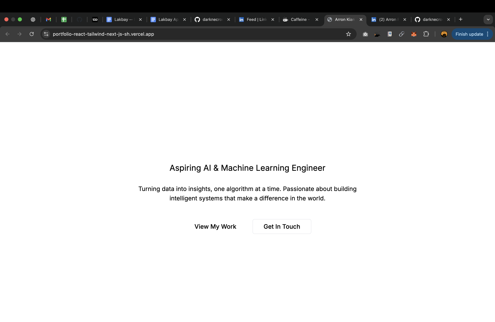

# 🚀 Arron Kian Parejas - AI/ML Portfolio

[](https://nextjs.org/)
[](https://www.typescriptlang.org/)
[](https://tailwindcss.com/)
[](https://www.framer.com/motion/)
[](https://ui.shadcn.com/)


> A modern, responsive portfolio website showcasing AI/ML expertise and projects. Built with cutting-edge web technologies for an immersive user experience.



## 📋 Overview

Welcome to my personal portfolio! I'm **Arron Kian Parejas**, an aspiring AI & Machine Learning Engineer passionate about turning data into insights and building intelligent systems that make a positive impact on the world.

This portfolio serves as a comprehensive showcase of my journey, skills, projects, and aspirations in the field of artificial intelligence and machine learning.

## 🛠️ Tech Stack

### Core Technologies
- **⚛️ Next.js 16** - React framework for production
- **🔷 TypeScript** - Type-safe JavaScript
- **🎨 Tailwind CSS 4** - Utility-first CSS framework
- **🎭 Framer Motion** - Animation library for React

### UI Components & Libraries
- **🧩 shadcn/ui** - Re-usable UI components
- **🎯 Lucide React** - Beautiful icons
- **📝 React Hook Form** - Performant forms
- **🔧 Class Variance Authority** - Component variants
- **🎨 Tailwind Merge** - Conditional styling

### Development Tools
- **📦 ESLint** - Code linting
- **🔍 PostCSS** - CSS processing
- **📱 Autoprefixer** - CSS vendor prefixes

## ✨ Features

### 🎯 Core Sections
- **🏠 Hero** - Eye-catching introduction with call-to-action buttons
- **👨‍💻 About** - Personal journey and passion for AI/ML
- **🎯 Objective** - Professional goals and career aspirations
- **🛠️ Skills** - Technical expertise with proficiency levels
- **💼 Projects** - Showcase of AI/ML projects and achievements
- **🏆 Certifications** - Professional credentials and courses
- **🔧 Tools** - Comprehensive tech stack and development tools
- **📞 Contact** - Contact form and professional links
- **📄 Footer** - Quick navigation and social links

### 🎨 Design & UX
- **📱 Fully Responsive** - Optimized for all device sizes
- **🌙 Dark/Light Mode Ready** - Built with design system flexibility
- **🎭 Smooth Animations** - Framer Motion powered transitions
- **♿ Accessibility** - Semantic HTML and ARIA compliance
- **⚡ Performance Optimized** - Fast loading and smooth interactions

### 🚀 Functionality
- **📧 Contact Form** - Functional contact form with validation
- **🔗 Social Links** - Direct links to GitHub, LinkedIn, and email
- **📱 Mobile Navigation** - Responsive navigation menu
- **🎯 Smooth Scrolling** - Seamless section navigation
- **📊 Interactive Elements** - Hover effects and micro-interactions

## 🚀 Getting Started

### Prerequisites
- Node.js 18+ ([Download here](https://nodejs.org/))
- npm or yarn package manager

### Installation

1. **Clone the repository**
   ```bash
   git clone https://github.com/arronkianparejas/portfolio.git
   cd portfolio
   ```

2. **Install dependencies**
   ```bash
   npm install
   # or
   yarn install
   ```

3. **Run the development server**
   ```bash
   npm run dev
   # or
   yarn dev
   ```

4. **Open your browser**
   Navigate to [http://localhost:3000](http://localhost:3000) to see the portfolio.

### Build for Production

```bash
npm run build
npm start
```

## 📁 Project Structure

```
portfolio/
├── src/
│   ├── app/
│   │   ├── globals.css          # Global styles
│   │   ├── layout.tsx           # Root layout component
│   │   └── page.tsx             # Home page
│   ├── components/
│   │   ├── ui/                  # Reusable UI components
│   │   │   ├── button.tsx
│   │   │   ├── card.tsx
│   │   │   ├── input.tsx
│   │   │   └── ...
│   │   ├── Hero.tsx             # Hero section
│   │   ├── About.tsx            # About section
│   │   ├── Skills.tsx           # Skills section
│   │   ├── Projects.tsx         # Projects showcase
│   │   ├── Certifications.tsx   # Certifications display
│   │   ├── Tools.tsx            # Tools & tech stack
│   │   ├── Contact.tsx          # Contact form
│   │   └── Footer.tsx           # Footer component
│   └── lib/
│       └── utils.ts             # Utility functions
├── public/                      # Static assets
├── package.json                 # Dependencies and scripts
├── tailwind.config.js           # Tailwind configuration
├── next.config.js               # Next.js configuration
└── tsconfig.json                # TypeScript configuration
```

## 🌐 Deployment

### Vercel (Recommended)
1. Connect your GitHub repository to [Vercel](https://vercel.com)
2. Deploy automatically on every push to main branch
3. Custom domain support included

### Other Platforms
- **Netlify**: Drag & drop deployment or Git integration
- **Railway**: Full-stack deployment with database support
- **AWS Amplify**: Scalable hosting with CI/CD

## 🤝 Contributing

Contributions are welcome! Please feel free to submit a Pull Request.

1. Fork the project
2. Create your feature branch (`git checkout -b feature/AmazingFeature`)
3. Commit your changes (`git commit -m 'Add some AmazingFeature'`)
4. Push to the branch (`git push origin feature/AmazingFeature`)
5. Open a Pull Request

## 📄 License

This project is licensed under the ISC License - see the [LICENSE](LICENSE) file for details.

## 📞 Contact

**Arron Kian Parejas**
- 📧 Email: arronkianparejas@email.com
- 💼 LinkedIn: [linkedin.com/in/arronkianparejas](https://linkedin.com/in/arronkianparejas)
- 🐙 GitHub: [github.com/arronkianparejas](https://github.com/arronkianparejas)
- 📍 Location: San Francisco, CA

---

<div align="center">
  <p>Built with ❤️ using Next.js, TypeScript, and Tailwind CSS</p>
  <p>
    <a href="#overview">Overview</a> •
    <a href="#-tech-stack">Tech Stack</a> •
    <a href="#-features">Features</a> •
    <a href="#-getting-started">Getting Started</a> •
    <a href="#-contact">Contact</a>
  </p>
</div>
